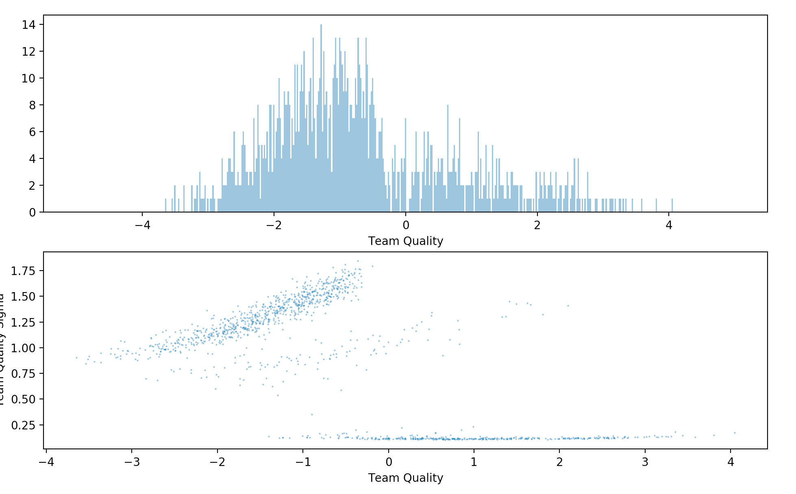

# Variational ELO for NCAAM Basketball 2002-2018

This is just a toy model to learn how to use [Pyro-PPL](https://pyro.ai). 

Uses games from 2002-2018 from Ryan Westerman's [dataset on data.world](https://data.world/rwesterman/ncaa-basketball-games-with-outcomes-2002-2018).

Fits a classical elo model w/ mean field posteriors. 

```
\logit(P(team a beats team b at home for team a)) = eta_a - eta_b + mu_home

eta_t ~ N(0, \sigma^2_T)
mu_home ~N(0, 1)
log(sigma^2_T) ~ N(0, 1)
```

And learns independent gaussian varitional posteriors (mean field) for all parameters.

The model does not address time in any way - all games are treated as coming from one 16 year season.

## Output

We learn a posterior mean and sigma for all team quality terms.  You can see in the plot below that there is a line of teams with low uncertainty (D1 teams) and then a cluster of teams with lower quality and much higher uncertainty (the D2 and D3 teams that play a few games a year against D1 opponents).




Top 20 Teams (2002-2018)

team_id  team_loc  team_scale       team_name
3           3  4.117532    0.158716          Kansas
1142     1142  3.925897    0.142423            Duke
811       811  3.673764    0.136719  North Carolina
926       926  3.521789    0.140202        Kentucky
270       270  3.417975    0.166304         Gonzaga
581       581  3.362034    0.134804  Michigan State
1173     1173  3.329610    0.135522      Louisville
636       636  3.318774    0.126101       Wisconsin
228       228  3.252279    0.124778       Villanova
307       307  3.245923    0.130126         Arizona
937       937  3.231030    0.131917        Syracuse
791       791  3.173766    0.129211         Florida
733       733  3.109020    0.125651      Ohio State
424       424  3.074265    0.126176           Texas
657       657  3.058153    0.129009      Pittsburgh
705       705  3.036528    0.136308      Notre Dame
149       149  2.975302    0.124163        Maryland
827       827  2.896946    0.126974          Xavier
466       466  2.892369    0.115101        Virginia
607       607  2.860635    0.126801        Oklahoma


Top 10 most uncertain teams (just to show that they are non-D1)

team_id  team_loc  team_scale               team_name
68         68 -0.447611    1.925912              Middlebury
1025     1025 -0.336367    1.896740           Bemidji State
49         49 -0.526100    1.894665  American International
866       866 -0.461130    1.861554                Marietta
1124     1124 -0.414623    1.859332     Saint Joseph's (ME)
847       847 -0.448507    1.838682          Lebanon Valley
1039     1039 -0.252159    1.829058               Morehouse
1122     1122 -0.555787    1.823220        Oklahoma Baptist
1018     1018 -0.772689    1.801807                Lawrence
948       948 -0.266656    1.800887          Mountain State


